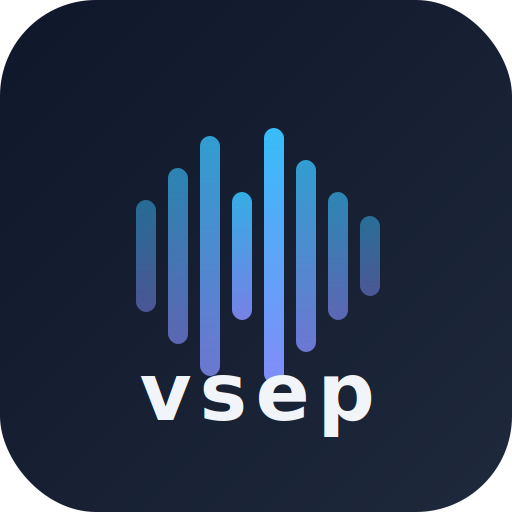

<div align="center">

<br/>
<b>vsep</b> — Lightning-Fast Audio Stem Separator
<br/>
<a href="https://github.com/BF667-IDLE/vsep/wiki">Wiki</a> ·
<a href="https://colab.research.google.com/github/BF667-IDLE/vsep/blob/main/notebooks/vsep_demo.ipynb">Colab Demo</a> ·
<a href="https://opensource.org/licenses/MIT">MIT License</a>
<br/>
[](https://www.python.org/downloads/)
[](https://opensource.org/licenses/MIT)
[](https://colab.research.google.com/github/BF667-IDLE/vsep/blob/main/notebooks/vsep_demo.ipynb)
</div>

**vsep** is a high-performance audio stem separator that splits music into individual components — vocals, drums, bass, and other instruments — using state-of-the-art AI models originally developed for [Ultimate Vocal Remover (UVR)](https://ultimatevocalremover.com/). It supports 100+ pre-trained models across four major architectures (Demucs, MDX-Net, VR, and Roformer/MDXC), runs on any hardware from CPUs to NVIDIA GPUs and Apple Silicon, and offers parallel model downloads with resume support for a seamless experience. Whether you are a music producer isolating vocals for a remix, a podcaster cleaning up background noise, or a researcher experimenting with source separation, vsep provides a simple CLI and Python API to get results fast.

---

## Table of Contents

- [Features](#-features)
- [Quick Start](#-quick-start)
  - [Prerequisites](#prerequisites)
  - [Installation](#installation)
  - [Basic Usage (CLI)](#basic-usage-cli)
  - [Basic Usage (Python API)](#basic-usage-python-api)
- [Supported Architectures](#-supported-architectures)
- [Model Gallery](#-model-gallery)
- [Configuration](#-configuration)
- [Advanced Features](#-advanced-features)
  - [Ensemble Separation](#ensemble-separation)
  - [Chunking for Long Files](#chunking-for-long-files)
  - [Output Customization](#output-customization)
  - [Remote Deployment](#remote-deployment)
- [Performance Benchmarks](#-performance-benchmarks)
- [Project Structure](#-project-structure)
- [Development](#-development)
- [Contributing](#-contributing)
- [License](#-license)
- [Acknowledgments](#-acknowledgments)

---

## 🚀 Features

| Feature | Description |
|---------|-------------|
| **⚡ Fast Parallel Downloads** | Downloads models with up to 8 parallel threads and automatic resume, achieving 4–8× speedup over sequential downloads. |
| **🔄 Resume Support** | Automatically detects and resumes interrupted downloads using HTTP Range headers. |
| **🎯 Four Architectures** | First-class support for MDX-Net, VR Band Split, Demucs v4 (Hybrid Transformer), and Roformer/MDXC models. |
| **🎚️ Ensemble Mode** | Combine multiple models with weighted or algorithmic ensembling (11 algorithms) for higher-quality output. |
| **💻 Universal Hardware** | Runs on NVIDIA CUDA, Apple MPS (Metal), AMD/Intel DirectML, or plain CPU — auto-detected at startup. |
| **🔊 Audio Chunking** | Process arbitrarily long audio files in fixed-length chunks, keeping memory usage bounded. |
| **🔧 Centralized Config** | All repository URLs, download settings, and tuning knobs live in `config/variables.py`. |
| **🌐 Remote API** | Deploy as a cloud service on Modal or Google Cloud Run and call it via REST client. |
| **📊 Model Scoring** | Each model ships with SDR/SIR/SAR/ISR benchmark scores to help you choose the right one. |

---

## 🎯 Quick Start

### Prerequisites

- **Python 3.10+** (3.13 supported with `audioop-lts` fallback)
- **FFmpeg** — required by pydub for audio I/O. Install via your system package manager:
  - Ubuntu/Debian: `sudo apt install ffmpeg`
  - macOS: `brew install ffmpeg`
  - Windows: download from [ffmpeg.org](https://ffmpeg.org/download.html) or `choco install ffmpeg`
- **PyTorch 2.3+** — installed automatically with `requirements.txt`; for GPU support see the [platform-specific install guide](INSTALL.md).
- **Git** — to clone the repository.

### Installation

```bash
# 1. Clone the repository
git clone https://github.com/BF667-IDLE/vsep.git
cd vsep

# 2. Install core dependencies
pip install -r requirements.txt

# 3. Verify the installation
python -c "from separator import Separator; print('vsep installed successfully!')"
```

<details>
<summary><b>Development installation</b></summary>

```bash
# Includes pytest, black, and other dev tooling
pip install -r requirements-dev.txt
```

</details>

<details>
<summary><b>GPU acceleration (NVIDIA CUDA)</b></summary>

```bash
# Replace the CPU onnxruntime with the GPU variant
pip uninstall onnxruntime -y && pip install onnxruntime-gpu

# Ensure PyTorch was installed with CUDA support
python -c "import torch; print(torch.cuda.is_available())"
```

</details>

See [INSTALL.md](INSTALL.md) for full platform-specific instructions (Windows NVIDIA/AMD, macOS Apple Silicon, Linux CUDA).

### Basic Usage (CLI)

The command-line interface lives at `utils/cli.py`. All examples below assume you are in the `vsep/` project root.

```bash
# Separate a song using the default model (BS-Roformer)
python utils/cli.py your_song.mp3

# Use a specific model
python utils/cli.py your_song.mp3 -m UVR-MDX-NET-Inst_1.onnx

# Specify output format and directory
python utils/cli.py your_song.mp3 -m ht-demucs_ft.yaml --output_format WAV --output_dir ./output

# Extract only the vocals stem
python utils/cli.py your_song.mp3 --single_stem Vocals

# List all 100+ supported models with scores
python utils/cli.py --list_models

# Filter model list by stem type (e.g., only vocal models)
python utils/cli.py --list_models --list_stem vocals

# Filter by architecture (e.g., only Roformer models)
python utils/cli.py --list_models --list_type MDXC

# Show models grouped by task category
python utils/cli.py --list_models --list_format categories

# Download a model without separating
python utils/cli.py --download_model_only BS-Roformer-Viperx-1297.ckpt

# Enable debug logging
python utils/cli.py your_song.mp3 -d
```

### Basic Usage (Python API)

```python
from separator import Separator

# Initialize with defaults (auto-detects GPU, uses BS-Roformer model)
separator = Separator()

# Separate an audio file — returns list of output file paths
output_files = separator.separate("your_song.mp3")
print(f"Separated files: {output_files}")
# Example output: ['your_song_(Vocals).flac', 'your_song_(Instrumental).flac']
```

**Advanced usage with custom settings:**

```python
from separator import Separator
import config.variables as cfg

# Tweak download performance
cfg.MAX_DOWNLOAD_WORKERS = 8       # More parallel download threads
cfg.DOWNLOAD_CHUNK_SIZE = 524288   # 512 KB chunks (default: 256 KB)

# Initialize with custom parameters
separator = Separator(
    model_file_dir="./models",      # Where to store/download models
    output_dir="./output",          # Where to write separated stems
    output_format="FLAC",           # Output audio format
    sample_rate=44100,              # Output sample rate
    normalization_threshold=0.9,    # Peak normalization
    use_autocast=True,              # Faster GPU inference (FP16)
    mdx_params={
        "segment_size": 256,
        "overlap": 0.25,
        "batch_size": 4,
        "enable_denoise": True,
    },
)

output_files = separator.separate("your_song.mp3")
```

---

## 🏗️ Supported Architectures

vsep wraps four major source-separation architectures, each with its own model format and parameter space:

| Architecture | File Extension | Description | Typical Stems |
|:-------------|:---------------|:------------|:--------------|
| **Demucs v4** (Hybrid Transformer) | `.yaml` | Meta's hybrid transformer model with multi-band processing. Highest quality for 4-stem separation. | vocals, drums, bass, other |
| **MDX-Net** | `.onnx` | Open Neural Network Exchange models trained by UVR community. Fast and well-tested. | vocals, instrumental |
| **VR Band Split** | `.pth` | Band-split RNN models from early UVR versions. Good compatibility, supports TTA. | vocals, instrumental |
| **Roformer / MDXC** | `.ckpt` | Rotary-former models (BS-Roformer, Mel-Band-Roformer). State-of-the-art vocal quality with SDR scores up to 13+. | vocals, instrumental |

The architecture is auto-detected from the model filename. You do not need to specify it manually.

---

## 🎵 Model Gallery

vsep supports **100+ models** from the UVR ecosystem. Here is a curated selection of the most popular and highest-scoring models:

| Model Filename | Architecture | Stems | SDR (Vocals) | Notes |
|:---------------|:-------------|:------|:------------:|:------|
| `model_bs_roformer_ep_317_sdr_12.9755.ckpt` | Roformer | vocals, inst | 12.98 | **Default model** — best overall vocal quality |
| `Mel-Roformer-Viperx-1053.ckpt` | Roformer | vocals, inst | 12.61 | Mel-band variant, excels on complex mixes |
| `ht-demucs_ft.yaml` | Demucs v4 | vocals, drums, bass, other | 11.27 | Best 4-stem separation |
| `MDX23C-8KFFT-InstVoc_HQ.ckpt` | MDXC | vocals, inst | 11.95 | High-quality instrumental extraction |
| `UVR-MDX-NET-Inst_1.onnx` | MDX-Net | vocals, inst | 10.65 | Fast and reliable classic |
| `2_HP-UVR.pth` | VR | vocals, inst | — | Lightweight, supports TTA & post-processing |

> **Tip:** Run `python utils/cli.py --list_models` to see the full list with SDR/SIR/SAR/ISR scores and filter by stem type, filename, or architecture.

---

## ⚙️ Configuration

All configurable values are centralized in `config/variables.py`. You can override them at runtime before importing the `Separator`:

```python
import config.variables as cfg

# Repository URLs
cfg.UVR_PUBLIC_REPO_URL = "https://github.com/TRvlvr/model_repo/releases/download/all_public_uvr_models"
cfg.UVR_VIP_REPO_URL = "https://github.com/Anjok0109/ai_magic/releases/download/v5"

# Download behavior
cfg.MAX_DOWNLOAD_WORKERS = 4      # Parallel download threads (default: 4)
cfg.DOWNLOAD_CHUNK_SIZE = 262144  # Bytes per chunk (default: 256 KB)
cfg.DOWNLOAD_TIMEOUT = 300        # Seconds before timeout (default: 300)
cfg.HTTP_POOL_CONNECTIONS = 10    # Connection pool size (default: 10)
cfg.HTTP_POOL_MAXSIZE = 10        # Max pool connections (default: 10)
```

You can also set the model directory via the `VSEP_MODEL_DIR` environment variable:

```bash
export VSEP_MODEL_DIR=/path/to/my/models
python utils/cli.py song.mp3
```

See [`config/README.md`](config/README.md) for the full configuration reference.

---

## 🛠️ Advanced Features

### Ensemble Separation

Ensembling combines the outputs of multiple models to produce a single, higher-quality result. vsep supports 11 ensemble algorithms and named presets.

```bash
# Use a built-in ensemble preset
python utils/cli.py song.mp3 --ensemble_preset vocals_ensemble

# Custom ensemble: specify primary + extra models with an algorithm
python utils/cli.py song.mp3 \
  -m model_bs_roformer_ep_317_sdr_12.9755.ckpt \
  --extra_models UVR-MDX-NET-Inst_1.onnx Mel-Roformer-Viperx-1053.ckpt \
  --ensemble_algorithm median_wave

# Weighted ensemble (weights must match number of models)
python utils/cli.py song.mp3 \
  -m model1.ckpt --extra_models model2.onnx \
  --ensemble_algorithm avg_wave \
  --ensemble_weights 0.6 0.4

# List available presets
python utils/cli.py --list_presets
```

**Available ensemble algorithms:**

| Algorithm | Domain | Behavior |
|:----------|:-------|:---------|
| `avg_wave` | Time | Average the waveforms (default) |
| `median_wave` | Time | Median waveform — removes outlier artifacts |
| `min_wave` | Time | Minimum amplitude per sample |
| `max_wave` | Time | Maximum amplitude per sample |
| `avg_fft` | Frequency | Average in the frequency domain |
| `median_fft` | Frequency | Median in the frequency domain |
| `min_fft` | Frequency | Minimum magnitude spectrum |
| `max_fft` | Frequency | Maximum magnitude spectrum |
| `uvr_max_spec` | Frequency | UVR-style max spectral magnitude |
| `uvr_min_spec` | Frequency | UVR-style min spectral magnitude |
| `ensemble_wav` | Time | UVR's native waveform ensembling |

### Chunking for Long Files

Processing a 2-hour DJ set or podcast in one pass can exhaust GPU memory. Enable chunking to split the input into fixed-length segments, process them independently, and concatenate the results:

```python
separator = Separator(
    chunk_duration=600,  # Split into 10-minute chunks
)
output_files = separator.separate("long_podcast.mp3")
```

```bash
python utils/cli.py long_mix.mp3 --chunk_duration 600
```

> **Note:** Chunks are concatenated without overlap or crossfade. For most use cases this produces imperceptible seams. If you hear artifacts at chunk boundaries, try shorter durations (e.g., 120–300 seconds).

### Output Customization

```bash
# Output only the vocals stem (skip instrumental)
python utils/cli.py song.mp3 --single_stem Vocals

# Normalize peak amplitude to 0.9 (default)
python utils/cli.py song.mp3 --normalization 0.9

# Amplify quiet output to at least 0.5 peak
python utils/cli.py song.mp3 --amplification 0.5

# Custom output format and bitrate
python utils/cli.py song.mp3 --output_format MP3 --output_bitrate 320k

# Custom output stem names
python utils/cli.py song.mp3 --custom_output_names '{"Vocals": "lead_vocals", "Instrumental": "backing_track"}'

# Use soundfile for output (avoids OOM on very large files)
python utils/cli.py song.mp3 --use_soundfile

# Invert secondary stem via spectrogram (may improve quality)
python utils/cli.py song.mp3 --invert_spect
```

### Remote Deployment

Deploy vsep as a cloud API to offload GPU work to a server. Two deployment targets are supported:

**Modal (recommended — $30/month free GPU credits):**

```bash
pip install modal
modal setup
python remote/deploy_modal.py deploy
```

**Google Cloud Run:**

```bash
python remote/deploy_cloudrun.py deploy
```

Once deployed, use the Python API client or CLI to send jobs remotely:

```python
from remote import AudioSeparatorAPIClient

client = AudioSeparatorAPIClient("https://your-deployment.modal.run")
result = client.separate_audio_and_wait("song.mp3", model="model_bs_roformer_ep_317_sdr_12.9755.ckpt")
```

See [`remote/README.md`](remote/README.md) for full deployment and API documentation.

---

## 📊 Performance Benchmarks

All benchmarks measured on a single song (~4 minutes, stereo, 44100 Hz).

**Download Speed (100 MB model, 100 Mbps connection):**

| Method | Time | Speedup |
|:-------|-----:|:-------:|
| Sequential (single-thread) | ~60 s | 1× |
| vsep parallel (4 workers) | ~15 s | 4× |
| vsep parallel (8 workers) | ~8 s | 7.5× |

**Separation Speed (per 4-minute song):**

| Model | CPU (Intel i7) | GPU (NVIDIA RTX 3060) |
|:------|---------------:|----------------------:|
| BS-Roformer | ~60 s | ~15 s |
| Demucs v4 (ht-demucs-ft) | ~30 s | ~8 s |
| MDX-Net (UVR-MDX-NET-Inst_1) | ~45 s | ~12 s |
| VR Band Split (2_HP-UVR) | ~50 s | ~10 s |

> Your actual performance will vary depending on the specific model, audio length, sample rate, hardware, and driver versions. GPU acceleration requires CUDA (NVIDIA) or MPS (Apple Silicon) support.

---

## 📁 Project Structure

```
vsep/
├── config/                    # Centralized configuration
│   ├── variables.py           #   All tunable settings & URLs
│   ├── example_usage.py       #   Config usage examples
│   ├── __init__.py            #   Package exports
│   └── README.md              #   Configuration reference
├── separator/                 # Core separation engine
│   ├── separator.py           #   Main Separator class (entry point)
│   ├── common_separator.py    #   Shared logic for all architectures
│   ├── ensembler.py           #   Ensemble algorithm implementations
│   ├── audio_chunking.py      #   Chunk-based processing for long files
│   ├── architectures/         #   Per-architecture implementations
│   │   ├── mdx_separator.py   #     MDX-Net architecture
│   │   ├── vr_separator.py    #     VR Band Split architecture
│   │   ├── demucs_separator.py#     Demucs v4 architecture
│   │   └── mdxc_separator.py  #     MDXC / Roformer architecture
│   ├── roformer/              #   Roformer model loader & validation
│   │   ├── roformer_loader.py
│   │   ├── parameter_validator.py
│   │   ├── configuration_normalizer.py
│   │   └── ...
│   └── uvr_lib_v5/            #   UVR processing library (STFT, spectrograms, etc.)
│       ├── demucs/            #     Demucs model implementations
│       └── roformer/          #     Roformer network implementations
├── remote/                    # Cloud deployment
│   ├── deploy_modal.py        #   Modal.com deployment script
│   ├── deploy_cloudrun.py     #   Google Cloud Run deployment script
│   ├── api_client.py          #   Python API client for remote service
│   ├── cli.py                 #   Remote CLI tool
│   └── README.md              #   Deployment guide
├── utils/                     # Utilities
│   └── cli.py                 #   Command-line interface
├── notebooks/                 # Jupyter / Google Colab demos
│   └── vsep_demo.ipynb
├── docs/                      # Detailed documentation
│   ├── logo.svg               #   App logo (vector)
│   ├── logo.png               #   App logo (raster)
│   ├── API-Reference.md       #   Full API reference (Separator, CLI, config, ensemble)
│   ├── Architecture.md        #   Architecture overview with diagrams
├── wiki/                      # Wiki pages (mirrored to GitHub Wiki)
│   ├── Home.md                #   Wiki home page
│   ├── _Sidebar.md            #   Wiki navigation sidebar
│   └── ...                    #   Installation, CLI, Models, API, etc.
├── tools/                     # Development tools
│   ├── calculate-model-hashes.py
│   └── sync-to-github.py
├── requirements.txt           # Core dependencies
├── requirements-dev.txt       # Dev + test dependencies
├── pyproject.toml             # Project config (black, pytest)
├── pytest.ini                 # Test runner configuration
├── ensemble_presets.json      # Named ensemble presets
├── models.json                # Model registry
├── models-scores.json         # Benchmark scores for all models
├── model-data.json            # Model parameter metadata
├── LICENSE                    # MIT License
├── INSTALL.md                 # Platform-specific installation guide
├── CONTRIBUTING.md            # Contribution guidelines
└── README.md                  # This file
```

---

## 🔧 Development

### Setting Up a Development Environment

```bash
# Clone and enter the project
git clone https://github.com/BF667-IDLE/vsep.git
cd vsep

# Create a virtual environment (recommended)
python -m venv .venv
source .venv/bin/activate   # Linux/macOS
# .venv\Scripts\activate    # Windows

# Install all dependencies (including dev tools)
pip install -r requirements-dev.txt
```

### Running Tests

```bash
# Run the full test suite with coverage
pytest tests/ -v --cov=separator --cov-report=term-missing

# Run only a specific test file
pytest tests/unit/test_parameter_validator.py -v
```

### Code Formatting

vsep uses [Black](https://black.readthedocs.io/) with a 140-character line length:

```bash
# Format all Python files
black . --line-length 140

# Check without modifying
black . --line-length 140 --check
```

### Building from Source

```bash
poetry build
```

See [CONTRIBUTING.md](CONTRIBUTING.md) for detailed contribution guidelines, code of conduct, and PR workflow.

### Documentation

For in-depth documentation beyond this README:

| Document | Description |
|:---------|:------------|
| [Wiki](https://github.com/BF667-IDLE/vsep/wiki) | Complete documentation — Installation, CLI, Models, API, Config, Architecture, Colab, Troubleshooting |
| [`docs/API-Reference.md`](docs/API-Reference.md) | Full API reference — Separator class, CLI arguments, configuration variables, ensemble algorithms, remote API client |
| [`docs/Architecture.md`](docs/Architecture.md) | Architecture overview with diagrams — system design, model download pipeline, hardware acceleration, all 4 separation architectures |


---

## 🤝 Contributing

We welcome contributions from everyone! Whether it's a bug fix, a new feature, improved documentation, or a model compatibility patch — every contribution helps.

Please read [CONTRIBUTING.md](CONTRIBUTING.md) for the full contribution workflow, but here's a quick summary:

1. **Fork** the repository
2. **Create a feature branch** (`git checkout -b feature/my-feature`)
3. **Make your changes** and add tests where applicable
4. **Format code** with `black . --line-length 140`
5. **Commit** with a clear message (`git commit -m 'Add feature X'`)
6. **Push** to your fork (`git push origin feature/my-feature`)
7. **Open a Pull Request** against the `main` branch

---

## 📄 License

This project is licensed under the **MIT License** — see the [LICENSE](LICENSE) file for the full text. You are free to use, modify, and distribute this software for personal and commercial purposes.

> **Note on models:** Individual AI models downloaded through vsep may have their own licenses. Please check the license of each model before using it in commercial projects. VIP models require a paid subscription to [Anjok07's Patreon](https://patreon.com/uvr).

---

## 🙏 Acknowledgments

vsep is built on the shoulders of giants. We gratefully acknowledge:

- **[Anjok07](https://patreon.com/uvr)** — Primary model trainer and creator of Ultimate Vocal Remover, whose models form the backbone of vsep.
- **[TRvlvr](https://github.com/TRvlvr)** — Maintainer of the UVR model repository and application data.
- **[NomadKaraoke](https://github.com/nomadkaraoke)** — Creator of the [python-audio-separator](https://github.com/nomadkaraoke/python-audio-separator) project, which vsep extends.
- **Meta Research** — Developers of the [Demucs](https://github.com/facebookresearch/demucs) architecture.
- **The UVR community** — The many model trainers and contributors who make these models freely available.

---

## 💬 Support

| Channel | Link |
|:--------|:-----|
| **Bug Reports** | [GitHub Issues](https://github.com/BF667-IDLE/vsep/issues) |
| **Feature Requests** | [GitHub Issues](https://github.com/BF667-IDLE/vsep/issues) |
| **Discussions** | [GitHub Discussions](https://github.com/BF667-IDLE/vsep/discussions) |
| **Try It Free** | [Google Colab Demo](https://colab.research.google.com/github/BF667-IDLE/vsep/blob/main/notebooks/vsep_demo.ipynb) |
