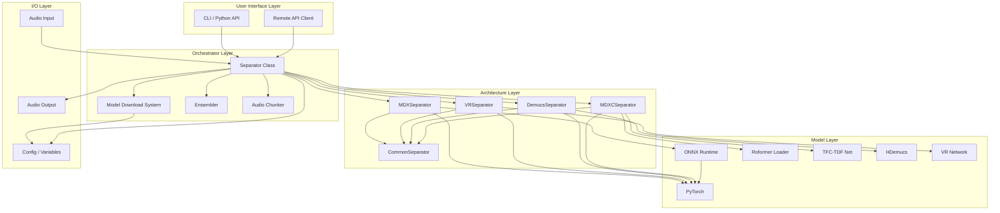
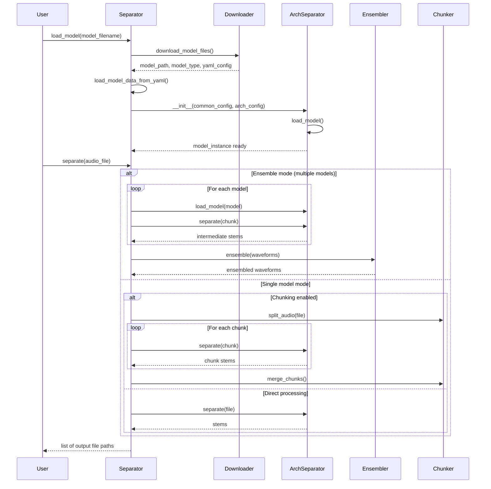
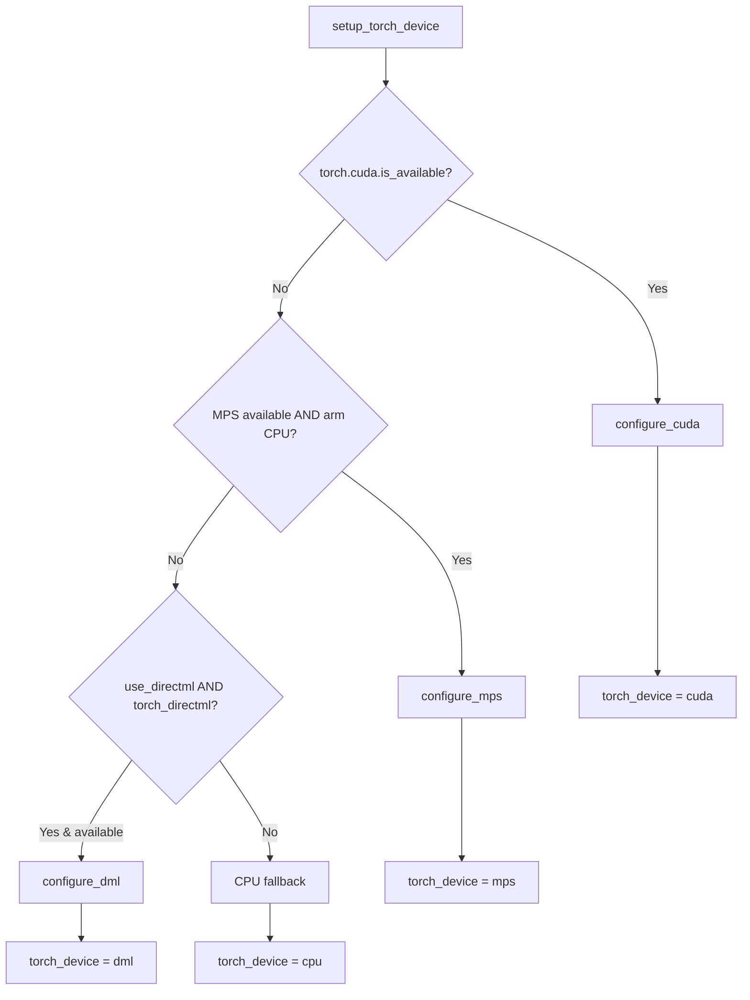
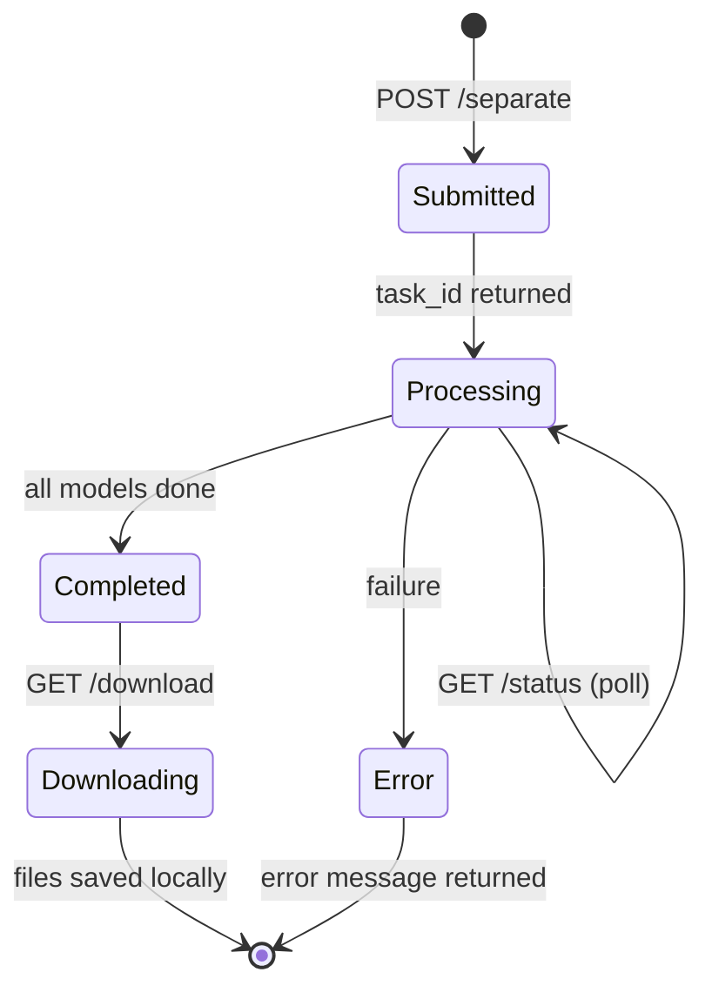

# Architecture Overview

This document provides a comprehensive technical overview of the vsep project, an AI-powered audio stem separator built on top of the Ultimate Vocal Remover (UVR) ecosystem. It describes the system architecture, component interactions, data flows, and design decisions that make up the separation pipeline.

---

## Table of Contents

1. [High-Level Architecture](#1-high-level-architecture)
2. [Separator Class](#2-separator-class)
3. [Model Download System](#3-model-download-system)
4. [Architecture Implementations](#4-architecture-implementations)
5. [Ensemble System](#5-ensemble-system)
6. [Audio Chunking](#6-audio-chunking)
7. [Hardware Acceleration](#7-hardware-acceleration)
8. [Remote Deployment](#8-remote-deployment)
9. [Configuration System](#9-configuration-system)
10. [Project Structure](#10-project-structure)

---

## 1. High-Level Architecture

The vsep system is a layered Python application that accepts an audio file as input and produces one or more separated audio stems (vocals, drums, bass, etc.) as output. It is designed as a thin orchestrator that delegates the actual inference work to architecture-specific separator classes, each of which wraps a different neural network backend.

### System Diagram



### Separation Pipeline Flow

The following diagram shows the end-to-end data flow from audio input to separated stems:



### Core Design Principles

The architecture follows several key design principles that influence all component interactions:

- **Single orchestrator, pluggable backends**: The `Separator` class in `separator/separator.py` is the sole entry point for users. It never performs inference itself; instead, it dynamically imports and instantiates the correct architecture-specific subclass (`MDXSeparator`, `VRSeparator`, `DemucsSeparator`, or `MDXCSeparator`) based on the detected model type. This keeps the orchestrator lean and allows new architectures to be added with minimal changes to existing code.

- **Shared base class for common behavior**: All four architecture separators inherit from `CommonSeparator`, which handles concerns that are not architecture-specific: audio loading via librosa, stereo conversion, output file writing with pydub or soundfile, normalization and amplification, GPU cache management, and stem naming conventions. This prevents code duplication across architectures while keeping architecture-specific logic cleanly separated.

- **Model data drives inference parameters**: Every model carries metadata (stored in YAML config files or looked up by MD5 hash in JSON data files) that specifies the exact STFT parameters, segment sizes, compensation factors, and stem assignments that were used during training. The separator classes read these values at load time and use them verbatim during inference, ensuring that the runtime configuration matches the training configuration exactly.

- **Graceful degradation for hardware**: The system probes for CUDA, MPS (Apple Silicon), and DirectML acceleration in priority order. If none are available, it falls back to CPU without any code changes required by the user. The same applies to ONNX Runtime execution providers.

---

## 2. Separator Class

The `Separator` class, defined in `separator/separator.py`, is the main orchestrator and the only class most users interact with directly. It is responsible for the full lifecycle of a separation task: environment setup, model acquisition, architecture dispatch, and result delivery.

### Initialization Flow

When a `Separator` instance is constructed, the following steps occur in order:

1. **Logger configuration**: A Python `logging.Logger` is created with the specified `log_level`. A `StreamHandler` is attached with a configurable formatter. If the log level is above DEBUG, Python warnings are suppressed to reduce noise.

2. **Directory setup**: The `model_file_dir` (where model files are cached) and `output_dir` (where separated stems are written) are resolved. The model directory can be overridden via the `VSEP_MODEL_DIR` or `AUDIO_SEPARATOR_MODEL_DIR` environment variables, taking precedence over the constructor parameter. Both directories are created with `os.makedirs` if they do not already exist.

3. **Parameter validation**: Output format, normalization threshold (must be in (0, 1]), amplification threshold (must be in [0, 1]), and sample rate (must be a positive integer below 12,800,000) are validated. Invalid values raise `ValueError` immediately.

4. **Ensemble preset loading**: If `ensemble_preset` is specified, the preset is loaded and validated from the bundled `ensemble_presets.json` resource file. The preset provides a list of models, an algorithm, and optional weights. User-supplied `ensemble_algorithm` and `ensemble_weights` take priority over preset defaults, allowing partial overrides.

5. **Architecture-specific parameter storage**: The four architecture parameter dictionaries (`mdx_params`, `vr_params`, `demucs_params`, `mdxc_params`) are stored in `self.arch_specific_params` for later dispatch to the appropriate separator class.

6. **Hardware acceleration setup**: The `setup_accelerated_inferencing_device()` method is called, which probes the system for GPU support and configures both `self.torch_device` and `self.onnx_execution_provider`. This step is skipped when `info_only=True` (used for model listing without inference).

### Model Loading

The `load_model()` method handles the full model acquisition and initialization pipeline:

1. If an ensemble preset provided a model list and no explicit model override was given, the preset model list is used.

2. If multiple model filenames are provided (a list with more than one entry), the method stores the list and returns immediately, deferring actual loading to the ensemble path in `separate()`.

3. For a single model, `download_model_files()` is called, which resolves the model filename to a download URL, downloads the file (and any companion YAML config files), and returns a tuple of `(model_filename, model_type, model_friendly_name, model_path, yaml_config_filename)`.

4. Model data (inference parameters) is loaded either from a YAML config file (for MDXC and Demucs models) or by computing the MD5 hash of the model binary and looking it up in UVR's model data JSON files (for MDX and VR models).

5. A `common_config` dictionary is assembled with all shared parameters (logger, device info, model metadata, output settings, sample rate, etc.).

6. The appropriate architecture-specific separator class is dynamically imported using `importlib.import_module()` and instantiated with `common_config` and the architecture-specific parameter dictionary. The class mapping is:
   - `"MDX"` -> `MDXSeparator`
   - `"VR"` -> `VRSeparator`
   - `"Demucs"` -> `DemucsSeparator`
   - `"MDXC"` -> `MDXCSeparator`

### Separation Dispatch

The `separate()` method accepts a file path (string), a directory path, or a list of paths. For directories, it recursively walks the tree and processes all recognized audio files (`.wav`, `.flac`, `.mp3`, `.ogg`, `.opus`, `.m4a`, `.aiff`, `.ac3`). Each file is processed through `_separate_file()`, which:

1. Checks if chunking is needed (when `chunk_duration` is set and the file exceeds the threshold).
2. Runs the architecture-specific `separate()` method on the model instance, optionally wrapped in `torch.amp.autocast` for mixed-precision inference when `use_autocast` is enabled and the device supports it.
3. Clears GPU cache and resets file-specific paths on the model instance to prevent stale state between files.

When multiple models are loaded for ensembling, `separate()` delegates to `_separate_ensemble()`, which runs each model sequentially, collects intermediate stems grouped by normalized stem name, then passes the waveform lists to the `Ensembler` for combination.

---

## 3. Model Download System

The model download system is responsible for acquiring model files from remote repositories, caching them locally, and resuming interrupted downloads. It is implemented across `separator/separator.py` (the orchestration logic) and `config/variables.py` (URL and configuration constants).

### Repository Architecture

The system draws model files from three primary sources:

| Repository | URL Pattern | Contents |
|---|---|---|
| UVR Public | `github.com/TRvlvr/model_repo/releases/download/all_public_uvr_models` | Public MDX, VR, Demucs, and MDXC models |
| UVR VIP | `github.com/Anjok0109/ai_magic/releases/download/v5` | Subscriber-only models (Anjok07's Patreon) |
| Audio Separator | `github.com/nomadkaraoke/python-audio-separator/releases/download/model-configs` | Fallback mirror for models and config files |

MDXC YAML configuration files are stored under a sub-path: `mdx_model_data/mdx_c_configs/` within the UVR public repo. Model data JSON files (used for MD5-based parameter lookup for MDX and VR models) are fetched from `raw.githubusercontent.com/TRvlvr/application_data/main/`.

### Download Flow

The download process follows a three-stage pipeline:

**Stage 1: `list_supported_model_files()`**

This method fetches the master model registry from UVR's `download_checks.json` and merges it with the project's own `models.json` (bundled as a package resource). Model scores from `models-scores.json` are attached. The result is a dictionary grouped by architecture type (`VR`, `MDX`, `Demucs`, `MDXC`), where each model entry contains its filename, performance scores, stem list, and a list of files to download.

**Stage 2: `download_model_files(model_filename)`**

Given a model filename, this method searches the grouped model list to find the matching entry, determines the model type and whether it is a VIP model, and builds a list of download tasks. Each task is a `(url, output_path)` tuple. For MDXC models, YAML config files are routed through `get_mdx_yaml_url()` to construct the correct sub-path URL. For Demucs models, some download entries are absolute URLs pointing to Facebook's Demucs model hosting. All other files use `get_repo_url(is_vip)` to select the appropriate repository.

**Stage 3: `_download_files_parallel(download_tasks)`**

This method uses `concurrent.futures.ThreadPoolExecutor` with up to `MAX_DOWNLOAD_WORKERS` (4) threads to download files concurrently. Each individual file download is handled by `download_file_if_not_exists()`, which:

- Skips the download entirely if the file already exists at the target path (cache hit).
- Creates a `requests.Session` with connection pooling (10 connections, 10 max pool size).
- Supports **resume** for interrupted downloads by checking for partial files and sending HTTP `Range` headers.
- Downloads in 256 KB chunks (configurable via `DOWNLOAD_CHUNK_SIZE` in `config/variables.py`).
- Displays a progress bar via `tqdm`.
- Enforces a 300-second timeout per request (configurable via `DOWNLOAD_TIMEOUT`).

**Fallback on failure**: If a download from the primary UVR repository fails, the system checks whether the URL was from `github.com` (but not the audio-separator repo itself). If so, it retries from the audio-separator fallback repository using `get_fallback_url()`. If the fallback also fails, a `RuntimeError` is raised.

### URL Routing in config/variables.py

The `config/variables.py` module centralizes all repository URLs, download configuration constants, and helper functions. Key functions:

- `get_repo_url(is_vip)`: Returns the VIP repo URL if `is_vip=True`, otherwise the public UVR repo URL.
- `get_mdx_yaml_url(filename)`: Constructs the full URL for an MDXC YAML config file under the `MDXC_YAML_PATH_PREFIX` sub-path.
- `get_fallback_url(filename)`: Constructs a URL pointing to the audio-separator releases repository.

---

## 4. Architecture Implementations

The system supports four distinct neural network architectures for audio source separation. Each is implemented in its own module under `separator/architectures/` and wraps a different model format and inference strategy.

### 4.1 MDX (MDX-Net)

**Background**: MDX-Net is a spectrogram masking architecture that operates in the Short-Time Fourier Transform (STFT) domain. Models are distributed as ONNX files and represent one of the earliest architectures supported by Ultimate Vocal Remover.

**Model file format and loading**: MDX models are `.onnx` files. The `MDXSeparator.load_model()` method checks whether the user-specified `segment_size` matches the model's `dim_t` parameter from the YAML data. If they match, the model is loaded directly into an ONNX Runtime inference session with the configured execution provider (CUDA, CoreML, DML, or CPU). If they do not match, the ONNX model is converted to a PyTorch model using `onnx2torch`, which allows custom segment sizes but is slower.

**Key parameters**:

| Parameter | Default | Effect |
|---|---|---|
| `hop_length` | 1024 | STFT hop length; affects time-frequency resolution tradeoff |
| `segment_size` | 256 | Number of STFT frames per processing segment; larger = better quality but more memory |
| `overlap` | 0.25 | Fractional overlap between adjacent segments (0.001-0.999); higher = smoother but slower |
| `batch_size` | 1 | Number of segments processed simultaneously; affects RAM usage, not quality |
| `enable_denoise` | False | Runs the model on both positive and negative spectrums and averages to reduce noise |

**Inference flow**: The audio mix is converted to the STFT domain using a custom `STFT` class (from `uvr_lib_v5/stft.py`). The first 3 frequency bins are zeroed to reduce low-frequency noise. The spectrum is passed through the model to produce a mask prediction. If denoising is enabled, the model is run on both the original and negated spectrums, and the results are averaged with a -0.5/+0.5 weighting. The masked spectrum is converted back to the time domain via inverse STFT. Overlapping segments are combined using a Hanning window with a weighted average. The secondary stem (e.g., instrumental when the primary is vocals) is computed by subtracting the primary from the original mix, or optionally by spectral inversion.

**Strengths**: Fast inference via ONNX Runtime. Well-optimized for 2-stem (vocals/instrumental) separation. Extensive model catalog with many community-trained options.

**Weaknesses**: Limited to 2-stem separation. STFT-based processing can introduce artifacts at segment boundaries. Custom segment sizes require slower ONNX-to-PyTorch conversion.

### 4.2 VR (Vocal Removal)

**Background**: The VR architecture (used in UVR v5) uses band-split recurrent neural networks that process audio in multiple frequency bands. Models are distributed as PyTorch state dictionaries. Two network variants exist: the legacy `nets` module (standard models) and the `nets_new` module with `CascadedNet` (VR 5.1 models).

**Model file format and loading**: VR models are `.pth` files (PyTorch state dictionaries). The network architecture is determined by the model file size, which is matched against a table of known architecture sizes. VR 5.1 models (sizes 56817 or 218409 KB) use `CascadedNet` with configurable `nout` and `nout_lstm` parameters from the model data. All other sizes use `determine_model_capacity()` from the `nets` module. The state dict is loaded onto CPU first, then moved to the target device.

**Key parameters**:

| Parameter | Default | Effect |
|---|---|---|
| `window_size` | 512 | Spectrogram patch size for inference (320/512/1024); smaller = slower but potentially better |
| `aggression` | 5 | Intensity of primary stem extraction (-100 to 100); higher = deeper extraction |
| `enable_tta` | False | Test-Time Augmentation; doubles processing time by running with shifted input |
| `enable_post_process` | False | Merges artifacts above a threshold to clean up vocal bleed |
| `post_process_threshold` | 0.2 | Sensitivity of the post-processing artifact merger (0.1/0.2/0.3) |
| `high_end_process` | False | Mirrors the missing high-frequency range back into the output |

**Inference flow**: The input audio is loaded through a multi-band processing pipeline defined by the model's parameter JSON file. Each frequency band is converted to a spectrogram with band-specific STFT parameters. The spectrograms are combined into a single multi-band representation. The magnitude spectrum is preprocessed and padded. The model predicts a mask, which is optionally averaged with a TTA (shifted) pass. The mask is adjusted for aggressiveness, optionally post-processed to merge artifacts, then applied to the magnitude and phase to produce separated spectrograms. These are converted back to waveforms using inverse STFT, with optional high-end mirroring. If the model sample rate differs from 44100 Hz, the output is resampled.

**Strengths**: Mature and battle-tested architecture. Multi-band processing handles different frequency ranges independently. Post-processing can clean up difficult separations. TTA improves quality at the cost of speed.

**Weaknesses**: Generally lower quality than newer MDXC/Roformer models. The file-size-based architecture detection is fragile. Processing is more complex and slower than MDX for comparable results.

### 4.3 Demucs (v4 Hybrid Transformer)

**Background**: Demucs is Meta's (Facebook's) open-source music source separation model. vsep supports Demucs v4, specifically the hybrid transformer variants (`htdemucs` and `htdemucs_ft`). These models use a U-Net architecture with transformer encoders and produce 4 or 6 stems simultaneously.

**Model file format and loading**: Demucs models consist of multiple `.th` (PyTorch) checkpoint files plus a `.yaml` descriptor. The model is loaded using `get_demucs_model()` from `uvr_lib_v5/demucs/pretrained.py`, which reconstructs the `HDemucs` model from the checkpoints stored alongside the YAML file. The `demucs_segments()` function optionally adjusts the internal segment size for memory management. The model is moved to the target device and set to evaluation mode.

**Key parameters**:

| Parameter | Default | Effect |
|---|---|---|
| `segment_size` | "Default" | Length of each segment in seconds; "Default" uses the model's optimal value |
| `shifts` | 2 | Number of random shifts for shift-averaging; higher = better but much slower |
| `overlap` | 0.25 | Overlap between prediction windows (0.25/0.50/0.75/0.99) |
| `segments_enabled` | True | Whether to split audio into segments; disable only on powerful hardware |

**Inference flow**: The input audio is normalized (zero-mean, unit-variance). The `apply_model()` function from `uvr_lib_v5/demucs/apply.py` processes the audio through the model with the configured shifts, overlap, and segmentation. Shift-averaging runs the model multiple times with random temporal shifts and averages the outputs to reduce boundary artifacts. The output is denormalized using the original statistics and converted to a numpy array. The channel order is swapped to match the expected (L, R) convention. The 4 output stems are mapped from the model's internal order (drums, bass, other, vocals) to named outputs.

**Strengths**: Produces 4 or 6 stems simultaneously (drums, bass, other, vocals, guitar, piano). State-of-the-art quality for multi-stem separation. Hybrid transformer architecture captures both local and global patterns.

**Weaknesses**: Significantly higher memory usage than 2-stem architectures. Slow without GPU acceleration. Requires Python 3.10+ due to use of `match` statements. Large model files (multiple checkpoints).

### 4.4 MDXC (MDX-Net v3 / TFC-TDF / Roformer)

**Background**: MDXC is the newest and most capable architecture in vsep, encompassing three related model families: the TFC-TDF v3 network (MDX23C models), the BS-Roformer (Band-Split Roformer), and the Mel-Band-Roformer. These models use advanced time-frequency convolution and transformer architectures to achieve state-of-the-art separation quality.

**Model file format and loading**: MDXC models are `.ckpt` files (PyTorch checkpoints) accompanied by `.yaml` configuration files. The `MDXCSeparator.load_model()` method loads the YAML data into an `ml_collections.ConfigDict`. For standard TFC-TDF models, the `TFC_TDF_net` class is instantiated with the config and the checkpoint is loaded. For Roformer models (detected via the `is_roformer` flag in the model data or by the presence of "roformer" in the path), the `RoformerLoader` is used instead, which supports a new-implementation path with configuration normalization and validation, plus a legacy fallback path for backward compatibility with older checkpoint formats.

The `RoformerLoader` class handles two sub-types:
- **BS-Roformer**: Identified by `freqs_per_bands` in the config. Uses band-split attention with configurable depth, heads, and frequency band structure.
- **Mel-Band-Roformer**: Identified by `num_bands` in the config. Uses mel-scaled frequency band decomposition with optional multi-resolution STFT loss.

**Key parameters**:

| Parameter | Default | Effect |
|---|---|---|
| `segment_size` | 256 | Number of STFT frames per segment; smaller = less memory |
| `override_model_segment_size` | False | Use user-specified segment size instead of model default |
| `overlap` | 8 | Overlap in samples between adjacent segments |
| `batch_size` | 1 | Chunks processed per batch (Roformer ignores this) |
| `pitch_shift` | 0 | Semitones to shift during processing (without affecting output pitch) |
| `process_all_stems` | True | For multi-stem models, output all stems rather than just primary/secondary |

**Inference flow**: For Roformer models, the audio is chunked using the model's STFT hop length to derive the temporal chunk size. Each chunk is processed through the model, with overlap-add using a Hamming window. For standard TFC-TDF models, the audio is unfolded into overlapping chunks using `torch.Tensor.unfold()`, batched, and processed through the network. Overlap is handled by accumulating outputs and dividing by the overlap count. If `pitch_shift` is non-zero, the input is pitch-shifted before processing and the output is shifted back. For single-target models, the secondary stem is computed by subtracting the primary from the original mix.

**Strengths**: Highest separation quality available in the project. Supports both 2-stem and multi-stem models. Roformer models represent the current state of the art. The `RoformerLoader` provides robust configuration normalization with legacy fallback.

**Weaknesses**: Most computationally demanding architecture. Roformer batch_size is not utilized due to negligible performance improvement. Model loading is more complex with multiple fallback paths. Short audio files (< 10 seconds) require special handling.

---

## 5. Ensemble System

The ensemble system allows multiple models to be combined for improved separation quality. By running several models on the same input and merging their outputs, ensemble methods can reduce model-specific artifacts and produce more robust results.

### Ensembler Class

The `Ensembler` class in `separator/ensembler.py` accepts a list of waveforms (one per model output) and combines them using a configurable algorithm. Each waveform is a numpy array of shape `(channels, length)`.

**Initialization**: The `Ensembler` is constructed with a logger, an algorithm name, and optional per-model weights.

**Pre-processing**: Before ensembling, all waveforms are zero-padded to the length of the longest waveform. If weights are provided, they are validated to ensure they have finite values and a non-zero sum. Invalid weights trigger a fallback to equal weights.

### Supported Algorithms

The system provides 11 ensemble algorithms divided into two categories:

**Wave-domain algorithms** (operate directly on time-domain audio):

| Algorithm | Weighted | Description |
|---|---|---|
| `avg_wave` | Yes | Weighted average of waveforms. The default and most commonly used. |
| `median_wave` | No | Element-wise median across waveforms. Robust to outlier models. |
| `min_wave` | No | For each sample position, selects the value with the smallest absolute amplitude from any model. Removes artifacts by choosing the quietest prediction. |
| `max_wave` | No | Selects the value with the largest absolute amplitude. Emphasizes stronger predictions. |

**Frequency-domain algorithms** (operate on STFT representations):

| Algorithm | Weighted | Description |
|---|---|---|
| `avg_fft` | Yes | Converts each waveform to STFT, computes the weighted average of complex spectra, then converts back via inverse STFT. |
| `median_fft` | No | Takes the median of real and imaginary parts of the STFT separately, then recombines. |
| `min_fft` | No | Selects the STFT bin value with the smallest magnitude across models. |
| `max_fft` | No | Selects the STFT bin value with the largest magnitude across models. |
| `uvr_max_spec` | No | Uses UVR's built-in `MAX_SPEC` spectrogram ensembling algorithm. |
| `uvr_min_spec` | No | Uses UVR's built-in `MIN_SPEC` spectrogram ensembling algorithm. |
| `ensemble_wav` | No | Uses UVR's legacy `ensemble_wav` function from `spec_utils`. |

### Preset System

Ensemble presets are defined in `ensemble_presets.json` (bundled as a package resource). Each preset specifies:

- **`name`**: Human-readable preset name
- **`description`**: Explanation of the preset's purpose
- **`models`**: List of model filenames to use (minimum 2)
- **`algorithm`**: The ensemble algorithm to apply
- **`weights`**: Optional per-model weights (must match model count)
- **`contributor`**: Attribution for the preset creator

When a preset is loaded, the `Separator` class validates that the preset exists, has at least 2 models, uses a valid algorithm, and has correctly-sized weights (if provided). The preset's algorithm and weights serve as defaults that can be overridden by explicit user arguments.

### Ensemble Execution Flow

When multiple models are loaded, the `Separator._separate_ensemble()` method orchestrates the ensemble:

1. For each input file, a temporary directory is created for intermediate outputs.
2. Each model is loaded and run sequentially via `_separate_file()`. Intermediate stems are written to the temp directory with default naming.
3. Stem names are extracted from intermediate filenames using a regex pattern (`_(StemName)`) and normalized using `STEM_NAME_MAP`. For example, "other" is mapped to "Instrumental" when the model also produced a "Vocals" stem.
4. After all models have run, waveforms are grouped by normalized stem name.
5. For each stem type, the `Ensembler` combines the waveforms using the configured algorithm.
6. The ensembled waveform is written to the output directory with a descriptive filename that includes the preset name or model identifiers.

---

## 6. Audio Chunking

The audio chunking system in `separator/audio_chunking.py` provides a mechanism for processing very long audio files that would otherwise exceed available GPU memory. It splits files into fixed-duration segments, processes each independently, and merges the results.

### AudioChunker Class

The `AudioChunker` class is a utility that wraps pydub's `AudioSegment` for splitting and concatenating audio files.

**Initialization**: Accepts a `chunk_duration_seconds` parameter (converted internally to milliseconds) and an optional logger.

**Key methods**:

- `split_audio(input_path, output_dir)`: Loads the input file using `AudioSegment.from_file()`, splits it into non-overlapping chunks of the configured duration, and exports each chunk as a numbered file (`chunk_0000.wav`, `chunk_0001.wav`, etc.) in the output directory. The last chunk may be shorter than the configured duration if the file length is not evenly divisible.

- `merge_chunks(chunk_paths, output_path)`: Loads each chunk file using `AudioSegment.from_file()` and concatenates them in order using pydub's `+` operator. The combined audio is exported to the specified output path.

- `should_chunk(audio_duration_seconds)`: Returns `True` if the audio duration exceeds the configured chunk duration, `False` otherwise.

### Integration with Separator

The `Separator._process_with_chunking()` method integrates the `AudioChunker` into the separation pipeline:

1. A temporary directory is created for chunk files and intermediate outputs.
2. The input file is split into chunks using `AudioChunker.split_audio()`.
3. Each chunk is processed through `_separate_file()` with chunking disabled (to prevent recursion). The output directory is temporarily redirected to the temp directory.
4. After processing, the output files from each chunk are grouped by stem name (extracted via regex from the filename).
5. For each stem, the chunk outputs are merged back together using `AudioChunker.merge_chunks()` into a single output file.
6. The temporary directory is cleaned up.

### Design Considerations

The chunking approach uses simple concatenation without crossfade or overlap between chunks. This means there is a risk of audible artifacts at chunk boundaries, particularly when the model's internal segment processing does not align with the chunk boundaries. The `chunk_duration` parameter should be chosen to be large enough to minimize boundary artifacts while small enough to fit in available memory. Typical values range from 300 to 900 seconds (5-15 minutes).

The `chunk_duration` parameter is distinct from the architecture-specific `segment_size` and `overlap` parameters. The former controls file-level splitting (handled by pydub), while the latter control model-level windowing within each chunk (handled by the architecture-specific separator).

---

## 7. Hardware Acceleration

The system supports four hardware acceleration backends: NVIDIA CUDA, Apple Silicon MPS/CoreML, DirectML (Windows), and CPU fallback. The acceleration setup occurs once during `Separator.__init__()` and the selected device is propagated to all architecture-specific separators.

### Device Detection Priority

The `setup_torch_device()` method in `separator/separator.py` probes for hardware in the following priority order:



### CUDA Configuration

When `torch.cuda.is_available()` returns `True`, the system sets `self.torch_device` to `torch.device("cuda")`. It then checks whether `CUDAExecutionProvider` is available in ONNX Runtime's provider list. If it is, ONNX models will also use CUDA acceleration. If not (e.g., if only the CPU variant of ONNX Runtime is installed), a warning is logged and ONNX inference will fall back to CPU even though PyTorch uses CUDA.

### MPS / Apple Silicon Configuration

Apple Silicon acceleration is enabled when three conditions are met: `torch.backends.mps` is available, `torch.backends.mps.is_available()` returns `True`, and the CPU architecture is `arm` (checked via `platform.uname().processor`). The device is set to `torch.device("mps")`. For ONNX Runtime, the system checks for `CoreMLExecutionProvider`. On MPS, some audio resampling operations in the VR architecture automatically switch to `"polyphase"` resampling mode, as the default resampler is not compatible with MPS tensors.

### DirectML Configuration

DirectML provides GPU acceleration on Windows devices that are not NVIDIA (e.g., AMD Radeon, Intel Arc). It requires the `torch_directml` package to be installed and `use_directml=True` to be explicitly passed to the `Separator` constructor (it is not enabled by default). The device is set via `torch_directml.device()`. ONNX Runtime acceleration requires the `onnxruntime-directml` package with `DmlExecutionProvider`.

### CPU Fallback

When no hardware acceleration is available, the system sets `self.torch_device` to `torch.device("cpu")` and `self.onnx_execution_provider` to `["CPUExecutionProvider"]`. This is the safest default and ensures the system works on any platform, albeit with significantly slower inference times.

### Dual Runtime Architecture

The system maintains two parallel runtime configurations: `self.torch_device` for PyTorch models (VR, Demucs, MDXC) and `self.onnx_execution_provider` for ONNX Runtime models (MDX). Both are configured independently based on what the respective runtime libraries report as available. This means it is possible, for example, to have PyTorch running on CUDA while ONNX Runtime falls back to CPU if the GPU variant is not installed.

---

## 8. Remote Deployment

The `remote/` module provides a client-server architecture for running audio separation in the cloud, enabling users without local GPU hardware to leverage cloud-based GPU instances.

### Cloud Backend Options

Two cloud deployment backends are supported:

| Backend | File | Description |
|---|---|---|
| **Modal** | `remote/deploy_modal.py` | Serverless GPU platform; scales automatically, pay-per-use |
| **Cloud Run** | `remote/deploy_cloudrun.py` | Google Cloud serverless containers; HTTP-based |

Both backends expose a compatible HTTP API with the same endpoints, allowing the client to target either without code changes.

### API Endpoints

The server exposes the following REST endpoints:

| Method | Path | Description |
|---|---|---|
| `POST` | `/separate` | Submit an audio file for separation (multipart file upload) |
| `GET` | `/status/{task_id}` | Poll job status and progress |
| `GET` | `/download/{task_id}/{file_hash}` | Download a result file by hash |
| `GET` | `/download/{task_id}/{filename}` | Download a result file by name (legacy) |
| `GET` | `/models` | List available models (human-readable) |
| `GET` | `/models-json` | List available models (JSON format) |
| `GET` | `/health` | Health check; returns server version |

### AudioSeparatorAPIClient

The `AudioSeparatorAPIClient` class in `remote/api_client.py` provides a Python client for the remote API:

**`separate_audio()`**: Submits a separation job asynchronously. It accepts the audio file path and the full set of separation parameters (model selection, output format, architecture-specific tuning). The file is uploaded as a multipart form submission with a 5-minute timeout. Returns a JSON response containing the `task_id`.

**`separate_audio_and_wait()`**: A convenience method that combines job submission, polling, and file download into a single blocking call. It submits the job, then polls `/status/{task_id}` at a configurable interval (default: 10 seconds) until the job completes, fails, or times out (default: 600 seconds). Progress information (percentage and current model index) is logged. On completion, it handles both legacy (list) and new (dict with hash keys) response formats for backward compatibility.

**`download_file()` / `download_file_by_hash()`**: Download individual result files. The hash-based method is preferred for reliability, as it avoids issues with URL-encoded filenames containing spaces or special characters.

**`list_models()`**: Queries the server for available models, with optional filtering and sorting.

**`get_server_version()`**: Retrieves the server's version string via the health endpoint, used for debugging compatibility issues.

### Job Lifecycle



---

## 9. Configuration System

The configuration system centralizes all tunable parameters, URLs, and environment-variable overrides in `config/variables.py`. This single file serves as the source of truth for download behavior, repository routing, and connection settings.

### Centralized Configuration Design

All configuration values in `config/variables.py` are module-level constants, making them importable from any part of the codebase:

```python
from config import UVR_PUBLIC_REPO_URL, MAX_DOWNLOAD_WORKERS, DOWNLOAD_CHUNK_SIZE
```

The constants are organized into logical sections:

- **Model Repository URLs**: Three repository base URLs for public, VIP, and fallback sources.
- **Model Path Mappings**: Sub-path prefixes for specific file types (e.g., `MDXC_YAML_PATH_PREFIX`).
- **Download Configuration**: Worker count, chunk size, timeout, and connection pool settings.
- **Model Data Files**: Local filenames for the VR and MDX model data JSON files.

### Helper Functions

The module provides three URL construction functions that encapsulate routing logic:

- `get_repo_url(is_vip=False)`: Returns the appropriate repository URL based on whether the model is a VIP (subscriber-only) model. This abstraction means callers never need to know the actual repository URLs.

- `get_mdx_yaml_url(filename)`: Constructs the full URL for an MDXC YAML config file, prefixing it with the UVR public repo URL and the MDXC sub-path. This keeps the path structure in one place.

- `get_fallback_url(filename)`: Constructs a URL pointing to the audio-separator releases repository. This is used when the primary download fails, providing a mirror that may be more available in certain network conditions.

### Environment Variable Overrides

The `Separator` class supports environment variable overrides for the model storage directory:

| Environment Variable | Priority | Description |
|---|---|---|
| `VSEP_MODEL_DIR` | 1 (highest) | New vsep-specific model directory override |
| `AUDIO_SEPARATOR_MODEL_DIR` | 2 | Legacy audio-separator model directory override |
| `model_file_dir` parameter | 3 (lowest) | Constructor parameter default |

This allows deployment configurations to control model storage without modifying code, which is particularly useful for containerized deployments where the model cache should be mounted as a volume.

### Mirror Repository Support

The download system's fallback mechanism provides implicit mirror support. If a download from the primary UVR public repository fails (e.g., due to GitHub rate limiting or regional restrictions), the system automatically retries from the audio-separator releases repository. This is handled in `_download_files_parallel()`, which catches download failures and routes them through `get_fallback_url()`.

For full mirror support (e.g., for deployments behind firewalls that block GitHub), the constants in `config/variables.py` can be overridden by modifying the file or by setting up a fork with different URLs. The helper functions ensure that all URL construction goes through a single point of change.

---

## 10. Project Structure

```
vsep/
|-- config/
|   |-- __init__.py               # Exports all config constants and helper functions
|   |-- variables.py              # Centralized URLs, download settings, helper functions
|   |-- README.md                 # Configuration documentation
|   |-- example_usage.py          # Usage examples for config module
|
|-- separator/
|   |-- __init__.py               # Package init
|   |-- separator.py              # Main Separator orchestrator class
|   |-- common_separator.py       # Shared base class for all architecture separators
|   |-- ensembler.py              # Ensemble combination algorithms (11 methods)
|   |-- audio_chunking.py         # Audio splitting and merging for large files
|   |
|   |-- architectures/
|   |   |-- __init__.py           # Package init
|   |   |-- mdx_separator.py      # MDX-Net ONNX architecture implementation
|   |   |-- vr_separator.py       # VR (Vocal Removal) PyTorch architecture
|   |   |-- demucs_separator.py   # Demucs v4 hybrid transformer architecture
|   |   |-- mdxc_separator.py     # MDXC/TFC-TDF/Roformer architecture implementation
|   |
|   |-- roformer/
|   |   |-- __init__.py           # Package init
|   |   |-- roformer_loader.py    # Roformer model loading with normalization and fallback
|   |   |-- configuration_normalizer.py  # Config normalization for different Roformer variants
|   |   |-- parameter_validator.py       # Base parameter validation framework
|   |   |-- parameter_validation_error.py # Custom exception for validation failures
|   |   |-- bs_roformer_validator.py     # BS-Roformer specific validation rules
|   |   |-- mel_band_roformer_validator.py # Mel-Band-Roformer validation rules
|   |   |-- model_loading_result.py      # Structured result type for load outcomes
|   |   |-- model_configuration.py        # Model configuration data classes
|   |   |-- bs_roformer_config.py         # BS-Roformer default configuration
|   |   |-- mel_band_roformer_config.py   # Mel-Band-Roformer default configuration
|   |   |-- README.md                     # Roformer subsystem documentation
|   |
|   |-- uvr_lib_v5/                # UVR v5 library (vendored/modified)
|       |-- __init__.py
|       |-- spec_utils.py          # Spectrogram utilities, normalization, ensembling
|       |-- stft.py                # Custom STFT/iSTFT implementation
|       |-- mdxnet.py              # MDX network definitions
|       |-- tfc_tdf_v3.py          # TFC-TDF v3 network for MDXC models
|       |-- modules.py             # Shared neural network modules
|       |-- pyrb.py                # Python reimplementation of librosa functions
|       |
|       |-- demucs/                # Demucs model library (vendored)
|       |   |-- hdemucs.py         # HDemucs (hybrid transformer) model
|       |   |-- apply.py           # Model application with shifts and segmentation
|       |   |-- pretrained.py      # Model loading from checkpoint files
|       |   |-- repo.py            # Repository management for model files
|       |   |-- transformer.py     # Transformer encoder/decoder layers
|       |   |-- demucs.py          # Base Demucs model
|       |   |-- filtering.py       # Frequency filtering utilities
|       |   |-- ...
|       |
|       |-- roformer/              # Roformer model implementations (vendored)
|       |   |-- bs_roformer.py     # Band-Split Roformer network
|       |   |-- mel_band_roformer.py # Mel-Band-Roformer network
|       |   |-- attend.py          # Attention mechanism implementations
|       |
|       |-- vr_network/            # VR architecture network definitions
|           |-- nets.py            # Standard VR network architectures
|           |-- nets_new.py        # VR 5.1 CascadedNet architecture
|           |-- layers.py          # Network layer definitions
|           |-- layers_new.py      # New layer definitions for VR 5.1
|           |-- model_param_init.py # Model parameter loading from JSON
|           |-- modelparams/       # Band configuration JSON files
|               |-- 4band_44100.json
|               |-- 3band_44100.json
|               |-- 2band_44100.json
|               |-- ... (18+ band configs)
|
|-- remote/
|   |-- __init__.py               # Package init
|   |-- api_client.py             # AudioSeparatorAPIClient for remote API
|   |-- deploy_modal.py           # Modal serverless deployment script
|   |-- deploy_cloudrun.py        # Google Cloud Run deployment script
|   |-- cli.py                    # Remote CLI commands
|   |-- requirements.txt          # Remote-specific dependencies
|   |-- README.md                 # Remote deployment documentation
|
|-- utils/
|   |-- __init__.py               # Package init
|   |-- cli.py                    # Command-line interface implementation
|
|-- docs/
|   |-- API-Reference.md          # API documentation
|   |-- Architecture.md           # This document
|
|-- tools/
|   |-- sync-to-github.py         # Repository synchronization utility
|   |-- calculate-model-hashes.py # Model hash calculation for data files
|
|-- notebooks/
|   |-- vsep_demo.ipynb           # Interactive demo notebook
|
|-- pyproject.toml                # Project metadata and build configuration
|-- requirements.txt              # Runtime dependencies
|-- requirements-dev.txt          # Development dependencies
|-- pytest.ini                    # Test runner configuration
|-- models.json                   # Additional model registry (bundled resource)
|-- models-scores.json            # Model performance scores (bundled resource)
|-- model-data.json               # Extra model parameter data (bundled resource)
|-- ensemble_presets.json         # Ensemble preset definitions (bundled resource)
|-- README.md                     # Project readme
|-- CONTRIBUTING.md               # Contribution guidelines
|-- INSTALL.md                    # Installation instructions
```

### Module Responsibilities

| Module | Responsibility |
|---|---|
| `separator/separator.py` | Top-level orchestrator: logging, device setup, model download, architecture dispatch, ensemble coordination, chunking integration |
| `separator/common_separator.py` | Shared base class: audio loading, stereo conversion, output writing (pydub/soundfile), normalization, GPU cache management, stem naming |
| `separator/ensembler.py` | Wave-domain and frequency-domain ensemble algorithms (11 methods) |
| `separator/audio_chunking.py` | File-level splitting and merging for memory-efficient processing of long audio |
| `separator/architectures/mdx_separator.py` | MDX-Net ONNX model inference with STFT processing |
| `separator/architectures/vr_separator.py` | VR multi-band model inference with mask prediction |
| `separator/architectures/demucs_separator.py` | Demucs v4 hybrid transformer inference with shift-averaging |
| `separator/architectures/mdxc_separator.py` | MDXC/TFC-TDF/Roformer model inference with overlap-add |
| `separator/roformer/roformer_loader.py` | Roformer model loading with config normalization and legacy fallback |
| `config/variables.py` | Centralized URL routing, download parameters, and helper functions |
| `remote/api_client.py` | HTTP client for cloud-based separation API |
| `utils/cli.py` | Command-line argument parsing and execution |
